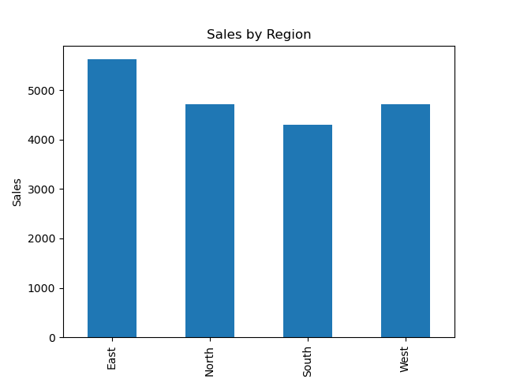

# 📊 Sales Data Analysis (Python + Pandas + Matplotlib)

## 📌 Project Overview

This project analyzes sales data to extract meaningful business insights using Python libraries like Pandas, NumPy, and Matplotlib.

---

## 📂 Dataset

The dataset contains:

- Sales
- Profit
- Region
- Product details

---

## ❓ Business Questions Answered

1. Which region has the highest total sales?
2. What is the average profit across all sales?
3. Which region is underperforming?

---

## 📊 Insights

- East region generated the highest sales (5620)
- South region has lower performance compared to others
- Average profit is approximately 181.75

---

## 📈 Visualization



---

## 🛠️ Tech Stack

- Python
- Pandas
- NumPy
- Matplotlib

---

## ▶️ How to Run

```bash
pip install -r requirements.txt
python main.py
```
